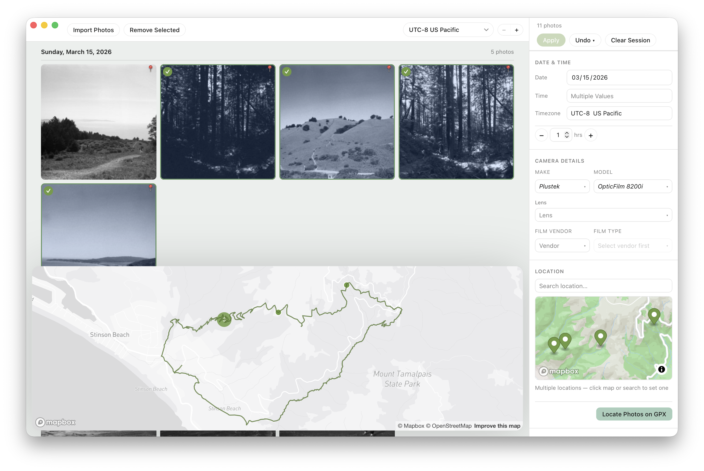
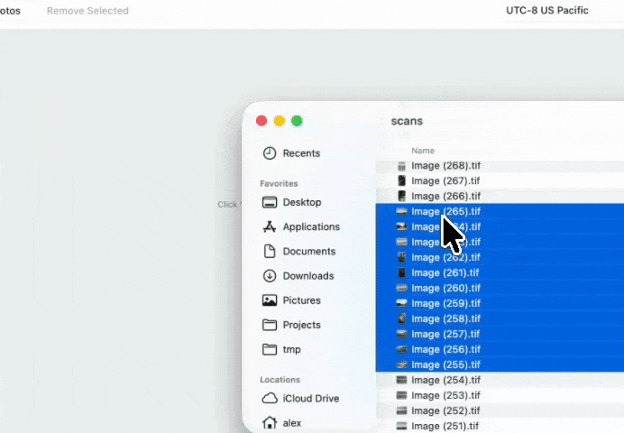
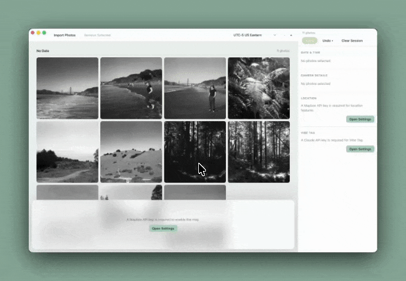
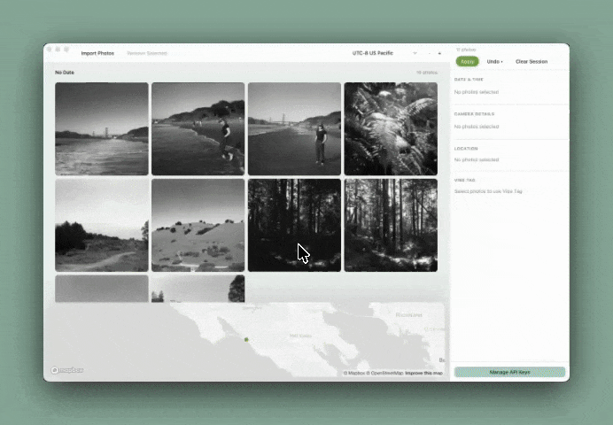
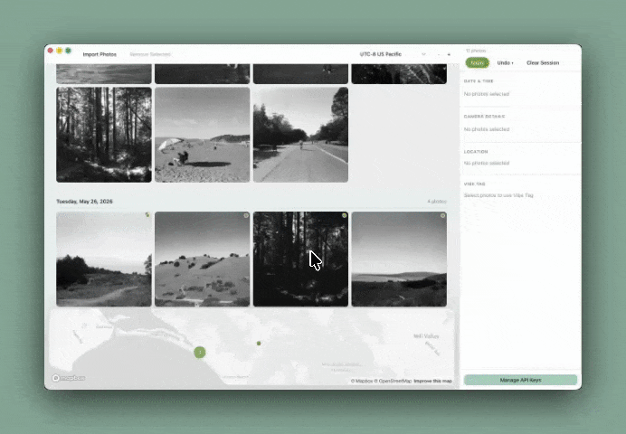
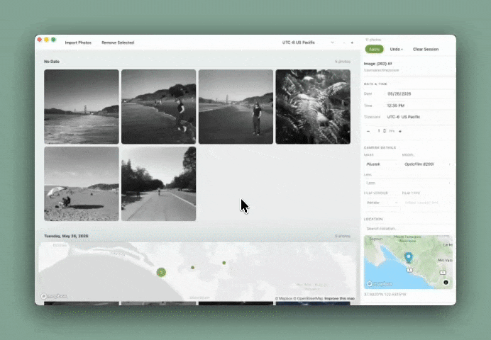
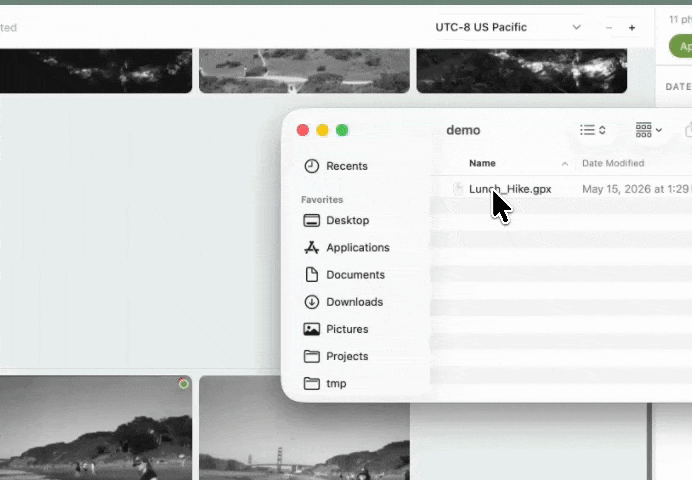
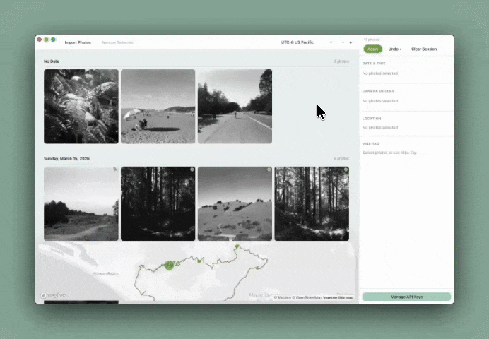
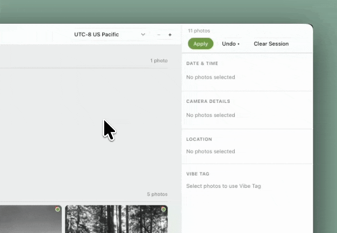
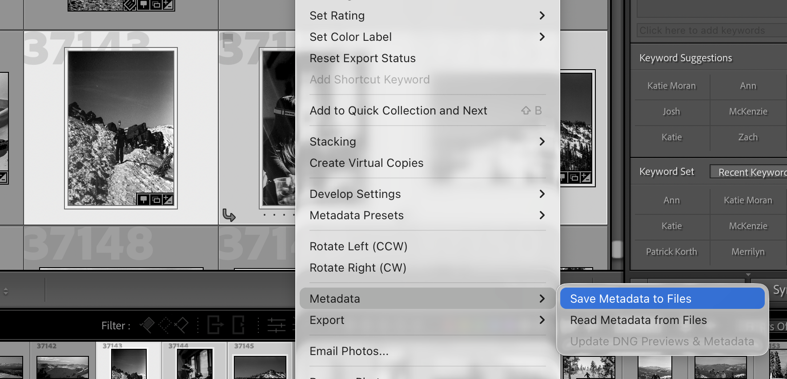

# Backstamp

A native macOS app for bulk-editing photo metadata. Designed for film photographers and mirrorless camera users whose photos lack GPS, have wrong timestamps, or have no metadata at all. Built with Tauri + React + TypeScript.



Film is regaining popularity but the tooling to digitize and manage film photos is out-dated and incomplete. One key pain point is setting common metadata for scanned photos like capture date and time, location, or camera details.

Today, if you just dump newly scanned film photos into Apple Photos or Lightroom, they'll end up lost in your timeline, with no cpature date or other metadata to organize them. Your only solution is to enter it all manually.

Entering these data today is tedious at best. Backstamp makes this dramatically easier for your film photos, or digital photos that lack important data (like location!) with a simple drag and drop interface and other UX optimizations.

## Features
### Broad File Support
Backstamp supports most common image file formats. Review the Specifications section for details. It automatically handles sidecar files for RAW images when necessary as well as metadata encoded directly in the image file.



### Comprehensive Metadata Support
Backstamp gives you tools to easily manage important metadata fields:

- Capture Date and Time
- Timezone
- Camera details (body, lens, and optionally film)
- Location

### Drag and Drop Interface
The core of Backstamp's interface is the drag-and-drop Photo Grid. Images get separated by day in Date Blocks as you set date information. They are always displayed chronologically from top to bottom. To support managing photos across timezones, you can set a Working Timezone to define cut-off times for creating Date Blocks.



Select one or more photos using traditional multi-select affordances and then make bulk changes as you need.

For fast metadata setting, Backstamp offers a few drag-and-drop features.

#### Drop to Inherit
You can drag selected photos and drop them on top of another to inherit that photo's metadata values like date, time, and location. This is convenient when sorting through photos that are jumbled together upon import.



#### Tweening
For more complex tagging, you can drag images between images to tween their values. For example, dropping an image between two images set at 7PM and 9PM will set the dropped image's time to 8PM. It will also tween GPS values.



### Inspector-Based Metadata Management
Use the Inspector to set metadata information. You can adjust one or more photos at a time through multi-select. For example, select all your photos to define the Camera body for them all. Or select a few to set the same date. Then, work individually through photos to set Capture Time, or use drag and drop inheritance or tweening to work faster.

#### Timezone Support
Set your photos' timezone to ensure the capture time is set accurately amongst your digital photos. You can auto-set timezones based on location as well.

#### Camera Details
Tag your photos with the camera make and model as well as lens information using the pre-populated list of common devices. If you have something more obscure, add custom tags as well.

Optionally, set the film stock used for film photos.

#### Simple Location Tagging
Tag your photos' location using simple location search and geo-coding. Make quick adjustments as needed and view where all your photos were taken on the main map.



##### GPX Support
Import GPX files to view the recorded route on the main map and auto-tag photo locations based on their set capture time.



### Tag with Vibes
If pointing and clicking is too tedious, use Vibe Tagging (BYO Claude API key) to set values with plain language.



### Robust File Management
Write your changes to disk only when you're ready, and rollback changes if you've made a mistake. The industry standard `ExifTool` is used under the hood to ensure your photos aren't corrupted and metadata is written appropriately.



## FAQs
1. **Can I just install this like a regular app?** Yes on Apple Silicon Macs you can download the DMG from the [Releases page](/releases) and install it just like any other Mac app. Following the instructions in the Install section for details.

2. **Do I need to configure anything to use this?** Yes! Basic functionality works out of the box. However, you will need to provide a MapBox API key for location functionality (and also an optional Google Maps API key for improved geocoding). You will also need to provide an Anthropic API key for Vibe Tagging. See the API Keys section below for details.

3. **Does this work with Lightroom and other photo management software?** Yes. However you will need to ensure that your photo management software writes metadata to the image files or sidecars instead of internal application databases. See the Lightroom workflow section below for details.

4. **Does this cost money?** The app distributed here is free as you need to provide your own API keys for full functionality. However, in the future a turnkey managed app may be released for a cost.

## Specifications

### Supported file formats

**Photos** — JPEG (`.jpg`, `.jpeg`), TIFF (`.tif`, `.tiff`), HEIC (`.heic`), and the following RAW formats: Adobe DNG (`.dng`), Canon (`.cr3`, `.cr2`), Nikon (`.nef`), Sony (`.arw`), Fujifilm (`.raf`), Olympus (`.orf`), Panasonic (`.rw2`), Pentax (`.pef`).

For JPEG, TIFF, and HEIC, metadata is written inline via an atomic temp-file + rename. For RAW formats, metadata is written to a companion `.xmp` sidecar file next to the original — the RAW itself is never modified. Existing XMP sidecars are detected on import and preserved on write.

**GPX** — Track logs in the GPX 1.0 / 1.1 format (`.gpx`) for auto-tagging photos with location and timezone from GPS track points. Multiple GPX files can be loaded per session as long as their timestamp ranges do not overlap.

### Operating system support

**Prebuilt DMG** — Apple Silicon (M-series) Macs only. Build it yourself for Intel Macs.

**Build from source** — macOS only. The app depends on macOS-specific facilities (Keychain for API-key storage, native NSMenu context menus, WKWebView via Tauri) and ships ExifTool for the bundled system Perl at `/usr/bin/perl`. Windows and Linux are not supported.

## Install

Download the latest DMG from the [Releases page](../../releases). Apple Silicon (M-series) Macs only.

Because the build is not yet signed by Apple, the first launch will be blocked by Gatekeeper with a message like *"backstamp can't be opened because Apple cannot check it for malicious software."* To open it:

1. In Finder, right-click (or Control-click) the app in `/Applications`.
2. Choose **Open**, then **Open** again in the confirmation dialog.

You only need to do this once per installed version.

## Usage
### API Keys

Backstamp uses three external API keys, all entered in **Settings** (gear icon in the top bar). Keys are stored in the macOS Keychain and never written to disk in plaintext.

#### Mapbox (required)

Required for map rendering, photo clustering, GPX route thumbnails, and location search fallback.

1. Sign up or log in at [mapbox.com](https://www.mapbox.com).
2. Go to **Account → Access tokens**.
3. Copy the **Default public token** (starts with `pk.`), or create a new public token.
4. Paste it into Backstamp → Settings → **Mapbox API Key**.

#### Google Maps (optional)

When set, replaces Mapbox for location type-ahead search and coordinate lookup. Map rendering always uses Mapbox regardless.

1. Go to the [Google Cloud Console](https://console.cloud.google.com) and create or select a project.
2. Open **APIs & Services → Library** and enable **Places API (New)**.
   - Do not enable the legacy "Places API" — Backstamp uses the newer v1 API.
3. Open **APIs & Services → Credentials** and click **Create credentials → API key**.
4. Click the pencil icon to edit the new key, then under **API restrictions** choose **Restrict key** and select **Places API (New)**. Save.
   - HTTP referrer restrictions do not apply to a desktop app, so leave application restrictions set to **None**.
5. Paste the key (starts with `AIza`) into Backstamp → Settings → **Google Maps API Key**.

#### Anthropic (required for Vibe Tag)

Required for the Vibe Tag natural-language metadata entry panel.

1. Go to [console.anthropic.com](https://console.anthropic.com) and create an API key.
2. Paste it into Backstamp → Settings → **Anthropic API Key**.

### Photo Management Workflows
Most users likely use something like Adobe Lightroom to manage their photos.

If you use Backstamp after saving scanned images to disk and before importing to your photo management software, there's no special processes needed. Just import from Finder and save your changes to disk. Them import to Lightroom or other applications.

If you already have photos imported to a photo management app, you'll need to follow some workflows. Most importantly, you want to ensure that you have Finder access to the source images, and that you can write the photo metadata to disk. In Lighroom, you can do this easily by selecting photos and choosing Metadata > Save Metadata to Files.



This writes all existing metadata as well as Lightroom edits to disk, either to the file itself or to the appropriate sidecar files.

After saving metadata to files, you can import the photos directly from Finder.

Once you've made your changes in Backstamp, Apply your changes, and then select your photos and right-click to select Metadata > Read Metadata from Files.

**IMPORTANT!** If you make edits to Lighroom photos you MUST save metadata to files, even if you have done it before. Otherwise, if you read metadata from files that don't include your lighroom edits, all of your edits will be overwritten.

## Building Yourself
### Prerequisites

- [NVM](https://github.com/nvm-sh/nvm) — Node version manager
- [Rust](https://rustup.rs) — via `rustup`
- Xcode Command Line Tools — `xcode-select --install`
- ExifTool — see **ExifTool setup** below

### ExifTool setup

ExifTool must be present in `src-tauri/resources/` before the app will build or run. It is not committed to the repository.

1. Download and run the **macOS Package** installer from [exiftool.org](https://exiftool.org). This installs the ExifTool script to `/usr/local/bin/exiftool` and its companion library to `/usr/local/bin/lib/`.

2. Copy both into the resources directory:

```sh
cp /usr/local/bin/exiftool src-tauri/resources/exiftool
chmod +x src-tauri/resources/exiftool
mkdir -p src-tauri/resources/lib
cp -r /usr/local/bin/lib/ src-tauri/resources/lib/
```

3. Verify:

```sh
src-tauri/resources/exiftool -ver
# should print: 13.55 (or current version)
```

ExifTool is a Perl script. It requires system Perl (`/usr/bin/perl`), which ships with all currently supported macOS versions. See the technical architecture doc for the full bundling story.

### Setup

```sh
nvm use          # picks up .nvmrc
npm install
```

Rust dependencies are fetched automatically by Cargo on first build.

### Development

```sh
npm run tauri dev
```

Starts the Vite dev server and the Tauri window together. Hot-module reload is active for the frontend; Rust changes require a recompile (Tauri handles this automatically).

If ExifTool is not found in `src-tauri/resources/`, the Rust backend falls back to `/opt/homebrew/bin/exiftool` and `/usr/local/bin/exiftool` for development convenience. The bundled copy is required for a production build.

### Testing

Two independent test suites cover the frontend and Rust backend.

**Frontend (Vitest + React Testing Library):**

```sh
npm test                # run once
npm run test:watch      # watch mode
npm run test:ui         # browser UI
npm run test:coverage   # coverage report
```

Tests live alongside the source they cover (e.g. `SessionContext.test.ts` next to `SessionContext.tsx`). The suite covers state reducers, Tauri IPC argument shapes, utility logic (apply payload building, GPX timestamp matching, timezone offset calculation, metadata field derivation, Claude proposal validation, selector grouping), drag-and-drop state machine, metadata inheritance and GPS interpolation, and component rendering for `PhotoTile`, `PhotoGrid`, `ImportModal`, `ApplyModal`, `SettingsModal`, `DateTimeSection`, `CameraSection`, `VibeTagSection`, `MapPanel`, `TopBar`, and `CameraConflictDialog`. Tauri IPC calls are mocked — no running desktop app is required.

**Rust (Cargo):**

```sh
cd src-tauri
cargo test
```

Unit tests live in `#[cfg(test)]` modules inside each source file. Integration tests live in `src-tauri/tests/`. The suite covers thumbnail resize logic, path key derivation, SQLite schema correctness, and metadata parsing from ExifTool JSON output. All tests run without a live ExifTool process — tests that require it are gated with `#[ignore]` and can be run with `cargo test -- --ignored`.

### Build

```sh
npm run tauri build
```

Produces an unsigned `.app` and `.dmg` in `src-tauri/target/release/bundle/`. The `src-tauri/resources/` directory (ExifTool script + library) is included in the bundle automatically via `tauri.conf.json`.

### Releasing

See [RELEASING.md](RELEASING.md) for the version-bump → build → smoke-test → publish flow. Releases are produced locally and uploaded to GitHub Releases via `gh`.

### Project structure

```
backstamp/
├── src/                                    # React + TypeScript frontend
│   ├── components/
│   │   ├── TopBar/                         # Apply, Roll Back, Reset buttons + photo count
│   │   ├── ApplyModal/                     # Two-phase apply progress overlay (applying → undoing)
│   │   ├── ImportModal/                    # Import progress overlay with error list
│   │   ├── SettingsModal/                  # API key management (Mapbox, Google Maps, Anthropic)
│   │   ├── common/
│   │   │   ├── CameraConflictDialog/       # Gap-drop camera data conflict resolution
│   │   │   ├── ConfirmDialog/              # Generic confirmation overlay
│   │   │   ├── CorpusComboBox/             # Searchable corpus-backed dropdown (make/model/lens/film)
│   │   │   ├── DevLogModal/                # Dev-mode error log viewer
│   │   │   └── ErrorModal/                 # User-facing error display
│   │   ├── PhotoManager/
│   │   │   ├── FloatingControls/           # Import Photos, Remove, Grid Size controls
│   │   │   ├── SubBar/                     # Secondary action bar
│   │   │   └── PhotoGrid/                  # Thumbnail grid
│   │   │       ├── PhotoTile.tsx           # Individual photo tile with pending-change indicator
│   │   │       ├── DayBlockHeader.tsx      # Sticky day group headers
│   │   │       ├── GapDropZone.tsx         # Drag-and-drop insertion targets
│   │   │       └── GpxTile.tsx             # GPX file tile with route thumbnail
│   │   ├── InspectorPanel/
│   │   │   ├── DateTimeSection/            # Date, time, timezone, hour-increment controls
│   │   │   ├── CameraSection/              # Make, Model, Lens, Film corpus comboboxes
│   │   │   ├── LocationSection/            # Mapbox mini-map, geocoding search, timezone mismatch alert
│   │   │   └── VibeTagSection/             # Claude chat interface for natural-language tagging
│   │   └── MapPanel/                       # Full-width Mapbox panel with photo clusters + GPX routes
│   ├── hooks/
│   │   ├── useDragDrop.ts                  # Drag-reorder state machine
│   │   └── useMetadataInheritance.ts       # Gap-drop timestamp interpolation + GPS lerp
│   ├── state/
│   │   ├── SessionContext.tsx              # Photos, selection, pending changes, undo history, GPX
│   │   ├── CorpusContext.tsx               # Camera / lens / film option lists with recent-use tracking
│   │   ├── UIContext.tsx                   # Grid columns, map height, working timezone, API keys
│   │   ├── DevLogContext.tsx               # Dev-mode console error/warning capture
│   │   └── selectors.ts                    # groupPhotosByDay() and flat ordering helpers
│   ├── lib/
│   │   ├── tauri.ts                        # Typed wrappers for all Tauri IPC commands
│   │   ├── applyUtils.ts                   # Builds ApplyPayload with UTC offset computation
│   │   ├── gpxMatching.ts                  # Track-point matching with timestamp interpolation
│   │   ├── inspectorUtils.ts               # deriveFieldValue(), buildPendingChange()
│   │   ├── timezone.ts                     # DST-correct UTC offset calculation
│   │   ├── timezones.ts                    # IANA timezone list
│   │   └── vibeTag.ts                      # Claude API client with tool-use loop + proposal validation
│   ├── test/                               # Test harness setup
│   │   ├── setup.ts                        # jest-dom + ResizeObserver mock
│   │   └── smoke.test.ts
│   └── styles/                             # Global CSS design system (tokens, layout, typography, components)
│
└── src-tauri/                              # Rust backend
    ├── resources/
    │   ├── exiftool                        # ExifTool CLI script (not committed — see setup)
    │   └── lib/                            # ExifTool Perl library (not committed — see setup)
    ├── tests/
    │   └── import_integration.rs           # Integration tests (DB schema, path key stability)
    └── src/
        ├── commands/                       # Tauri IPC handlers
        │   ├── photos.rs                   # import_photos, find_xmp_sidecars, remove_photos, reorder_photos
        │   ├── session.rs                  # load_session, clear_session
        │   ├── metadata.rs                 # apply_changes, apply_cancel, rollback, reset_photos, set/clear_pending_changes
        │   ├── thumbnails.rs               # get_thumbnail
        │   ├── corpus.rs                   # load/add/remove/record corpus entries
        │   ├── gpx.rs                      # import_gpx, remove_gpx, save_gpx_thumbnail
        │   ├── timezone.rs                 # resolve_timezone (via tzf-rs v1)
        │   ├── context_menu.rs             # show_photo_context_menu (native macOS)
        │   └── settings.rs                 # get_setting, set_setting (SQLite-backed)
        ├── exiftool.rs                     # ExifTool subprocess (-stay_open mode)
        ├── write_metadata.rs               # Field-to-ExifTool tag translation, inline + XMP sidecar writes
        ├── thumbnail.rs                    # SHA-256 keyed thumbnail generation (Lanczos3)
        ├── session.rs                      # SQLite schema, migrations (v0–v7), init
        ├── gpx.rs                          # GPX parsing + track-point extraction
        ├── corpus_seed.rs                  # Seeded camera/lens/film data
        └── lib.rs                          # AppState, plugin wiring, command registration
```

## Architecture

See [`product-requirements/technical-architecture.md`](product-requirements/technical-architecture.md) for the full technical design. Key decisions:

- **Tauri v2** — native macOS window via WKWebView; Rust handles all file I/O
- **ExifTool** (bundled) — the only tool with full coverage of all target RAW formats and EXIF/XMP/IPTC standards; runs in `-stay_open` mode for low-latency reads; writes via inline temp-file-rename (JPEG/HEIC) or XMP sidecar (RAW)
- **SQLite** (`rusqlite` with bundled feature) — session persistence, rollback history, corpus storage, settings
- **tzf-rs v1** — fast timezone-from-coordinates lookup (no network required)
- **Mapbox GL JS** — map rendering, photo clustering, GPX route overlays, and location search fallback (user-supplied API key)
- **Google Maps Places API (New)** — optional; replaces Mapbox for location type-ahead search and coordinate lookup when a Google Maps key is configured (user-supplied API key)
- **Claude API** (`claude-sonnet-4-6`) — natural language metadata entry via the Vibe Tag panel, with tool use for geocoding (user-supplied API key)
- No external state library — React `useReducer` + `useContext` only

## Backstamp Backstory
### Product requirements

See [`product-requirements/prd.md`](product-requirements/prd.md).

### Implementation plan

Phased plans live in [`product-specs/planning/`](product-specs/planning/).

| Phase | Plan | Status |
|---|---|---|
| 0 — Scaffold | [00-scaffold.md](product-specs/planning/00-scaffold.md) | Complete |
| 1 — Thumbnail generation & display | [01-thumbnails.md](product-specs/planning/01-thumbnails.md) | Complete |
| 2 — Full import pipeline + metadata reading | [03-import-pipeline.md](product-specs/planning/03-import-pipeline.md) | Complete |
| 3 — Photo grid: day blocks, selection, drag-and-drop | [04-photo-grid.md](product-specs/planning/04-photo-grid.md) | Complete |
| 4 — Inspector Panel fields with live editing | [05-inspector-panel.md](product-specs/planning/05-inspector-panel.md) | Complete |
| 5 — Apply / Rollback / Reset pipeline | [06-apply-rollback-reset.md](product-specs/planning/06-apply-rollback-reset.md) | Complete |
| 6 — Native macOS context menu | [07-context-menu.md](product-specs/planning/07-context-menu.md) | Complete |
| 7 — Map Panel (Mapbox) + Location section | [08-map-panel-location.md](product-specs/planning/08-map-panel-location.md) | Complete |
| 8 — GPX import and auto-tagging | [09-gpx-import-autotagging.md](product-specs/planning/09-gpx-import-autotagging.md) | Complete |
| 9 — Camera/Lens/Film corpus UI | [10-camera-corpus-ui.md](product-specs/planning/10-camera-corpus-ui.md) | Complete |
| 10 — Vibe Tag / Claude integration | [11-vibe-tag.md](product-specs/planning/11-vibe-tag.md) | Complete |
| 11 — Session persistence and restore | [12-session-persistence.md](product-specs/planning/12-session-persistence.md) | Complete |
