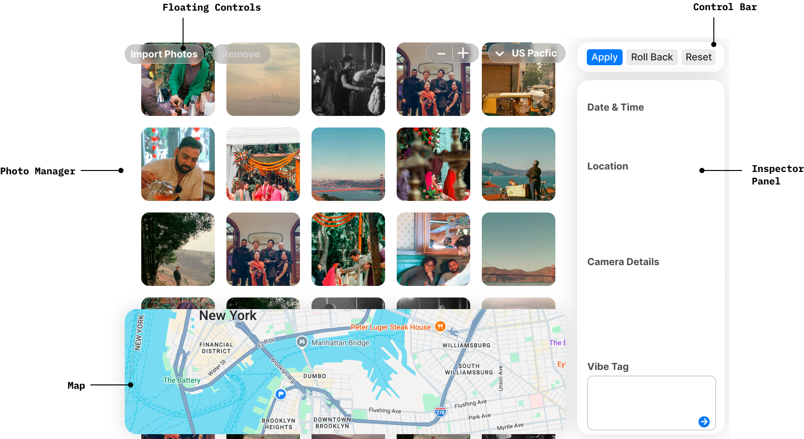

# Product Requirements Document
I am shooting film photos more often now, as well as taking pictures on a new mirrorless digital camera that does not have a GPS sensor. As a result I often have 1) scans of film photos in a random directory in my computer that have no meta-data at all (lens, camera type, GPS, time/date, etc) or 2) digital photos from my mirrorless camera which lack GPS coordinates and might have the wrong capture time set due to time-zone differences. I want to build a software product that I can load these photos into, and then quickly add meta-data to the photos in bulk by selecting one or many photos at a time and assigning metadata to them. This software will allow me to do so.

## Requirements

### High-level

1. Must run as a native app on my Mac OS desktop
2. Ideally uses web-based UI languages (React, CSS, etc) so that I can inspect and adjust the code manually
3. Must be able to read, write, modify files from disk
4. Must write meta-data in an industry standard (EXIF, XMP, IPTC, etc) that can be interpreted by tools like Apple Photos, Lightroom, etc
5. The visual design follows the macOS 26 design language: liquid glass controls, the macOS 26 system font stack (SF Pro), standard macOS 26 system button and text colors, and border radii using multiples of a 4px base unit.
6. The app must support dark mode. Dark mode is enabled automatically when the system is set to dark mode (`prefers-color-scheme: dark`). There is no in-app toggle; the app always follows the system setting. All UI elements — photo grid, inspector panel, map overlay, top bar, floating controls, and modals — must render correctly in both light and dark mode.
7. The software runs in sessions and a session persists across opening and closing the app, including all imported photos, GPX files, pending changes, and rollback history. I can clear a session at any time to start a new session. A confirmation dialog is shown before the session is cleared.
8. Only one session can exist at a time. The app cannot be opened in multiple windows or instances simultaneously.
9. Clearing a session discards all imported photos, GPX files, un-applied pending changes, and the full change history. Metadata that was already written to disk via a prior Apply is unaffected.
10. Video files are out of scope.

### Metadata standards & write behavior

1. The app must read and write photo metadata using industry standards:
    1. EXIF for capture time, camera/lens technical fields, and GPS coordinates (when supported by the file type).
    2. IPTC for descriptive fields (keywords, captions) where applicable.
    3. XMP for modern metadata storage and cross-application compatibility.
2. Supported file types and where metadata is written:
    1. Inline formats — metadata is written directly into the file container. Do not assume camera metadata exists; write new data as EXIF:
        1. `.jpg` / `.jpeg` — JPEG
        2. `.tif` / `.tiff` — TIFF
        3. `.heic` — HEIF (Apple and Canon HIF variant also accepted as `.heic`)
    2. RAW formats — by default do **not** modify the RAW file in-place; write metadata to an XMP sidecar file (`.xmp`) placed next to the RAW file. This behavior can be made configurable, but the default must be safe/non-destructive:
        1. `.dng` — Adobe Digital Negative (also used natively by Leica, Pentax, Google Pixel, DJI)
        2. `.cr3` — Canon RAW (current mirrorless/DSLR)
        3. `.cr2` — Canon RAW (legacy DSLR)
        4. `.nef` — Nikon RAW
        5. `.arw` — Sony Alpha RAW
        6. `.raf` — Fujifilm RAW
        7. `.orf` — Olympus / OM System RAW
        8. `.rw2` — Panasonic Lumix RAW
        9. `.pef` — Pentax RAW
    3. For all RAW formats: when bringing a photo into a session, look for an existing `.xmp` sidecar file next to each RAW file and treat that XMP content as the starting point for the session. If no sidecar exists, create one only when changes are Applied.
    4. Any file type not in the above lists is silently ignored during import (e.g. when scanning a dropped directory).
3. EXIF requirements for core fields:
    1. Capture time must be written to EXIF using `DateTimeOriginal` for all supported file types where EXIF writing is possible, including scanned JPEGs.
    2. GPS coordinates must be written to EXIF using `GPSLatitude` and `GPSLongitude` for all supported file types where EXIF writing is possible, including scanned JPEGs.
4. Read precedence (used for display and sorting):
    1. If XMP metadata is present, prefer it for user-edited fields when loading photos into a session.
    2. Otherwise fall back to EXIF.
    3. If neither exists, treat as unset (e.g. place in “No Date”).
5. Non-destructive metadata writing:
    1. The app must preserve existing metadata tags that it does not explicitly manage (do not wipe unknown tags).
    2. Metadata writes must be safe and robust: write changes atomically (e.g. temp file + rename) and surface per-file success/failure.
6. Canonical internal fields (the app’s internal data model) must include at least:
    1. Capture Date/Time (and optionally a user-assigned timezone when the file does not contain timezone info)
    2. Location (latitude/longitude, and optional place name/address)
    3. Camera Body, Lens, Film

### Photo Management

0. Photo Management is handled in the Photo Manager panel, which displays thumbnails of imported photos and is controlled using floating controls.
1. Photos can be loaded into the software either through file browsing or through drag and drop
    1. Clicking "Import Photos" in the Photo Manager panel floating controls opens a multi-select file picker for browsing and selecting files.
    2. Directories can be dragged and dropped in as well. Only compatible files within those directories and sub-directories will be imported.
2. Photo thumbnails are shown in a grid inside the Photo Manager panel
    1. If photo thumbnails need to be generated, display an Import modal that shows the progress for importing including generating and storing thumbnail files.
3. Photos are not moved on disk, only references to each file are stored.
4. Thumbnails are generated if necessary for rendering. Thumbnails are stored temporarily as part of a session.
5. Photos are displayed in chronological order by `DateTimeOriginal` or any similar EXIF Date Captured tag that is present in the photo metadata. The date the file was written to disk is not used.
6. Photos shown in blocks by day and then chronologically within that day by time.
7. Photos without “date captured” set are shown in “No Date” block above all other photos.
    1. Photos in the No Date block can be dragged to be re-ordered without updating the Date Captured data.
    2. By default photos in the No Date block are presented in order of Date Created for the file. This is for display/ordering purposes only in the No Date block.
8. If a file referenced by the session has been moved or deleted on disk, its thumbnail is greyed out and a visual indicator communicates that the file cannot be found. The user can click to clear that photo from the session. There is no re-linking flow.
9. I can select one or more photos at a time in the grid.
    1. Multi-select follows standard practice for multi-select (hold shift to select multiple, hold command to unselect a specific photo, etc)
10. I can add or remove files from the active selection using the same multi-select keyboard shortcuts at any time, even after making changes in the Inspector Panel.
11. I can remove one or more photos from the session by selecting them and clicking a "Remove Selected Photos" button in the Photo Manager panel floating controls. This does not delete the file from disk; it only removes the photo from the current session.
    1. When no photos are selected, the button says "Remove All Photos" which removes all photos from the session.
12. I can drag and drop selected photo(s) within the grid to re-order them.
13. If I drop one or more photos on top of another in the grid, the dropped photos inherit all of the properties from the photo that they were dropped on.
    1. When dragging photos around the grid, a photo in the grid turns dark to indicate you can drop there when hovering over a photo in the grid.
14. If I drop one or more photos in between two photos in a row of the grid, or to the left of the left-most photo or the right of the right-most photo in a row, the dropped photos inherit data from photos on either side according to rules defined in later Requirement sections.
    1. When dragging photos around the grid, a blue vertical line appears in the gap between photos when hovering there in a row to indicate you can drop there.
15. At the right hand side of the grid there is an Inspector panel with the following sections:
    1. Date & Time
    2. Camera Details
    3. Location
    4. Vibe Tag
16. The photo grid fills the full content area of the window and scrolls vertically. UI controls for managing photos float as overlays above it — there is no opaque sub-bar separating controls from photos.
    1. In the top-left corner of the photo grid, floating liquid glass controls include: an **Import Photos** button and a **Remove Selected Photos** button.
    2. In the top-right corner of the photo grid (to the left of the Inspector Panel), a floating **Working Time Zone** dropdown and a **Grid Size** +/- control float above the photos.
    4. The Working Time Zone dropdown is an IANA timezone selector. It controls only how photos are grouped into day blocks and how capture times are displayed. It does not write any data to photos and does not queue any pending changes. The default is US Pacific Time.
    5. The Grid Size control increases or decreases the size of photo thumbnails in the grid.
18. As a general principle, if a photo has meta-data set, it is never over-written to being “unset” (such as through drag and dropping) unless done-so explicitly in the right-hand Inspector panel.
19. If I select multiple photos that have different values for any meta-data, that section of the Inspector Panel says “Multiple Values” where there are multiple values. Where values match, those values are rendered.
    1. If I change the value for something that says “Multiple Values” that overwrites all of the unique values with the new single value. A confirmation dialog asks “Are you sure you want to change X values with this new value?”
    2. The Location section is an exception to the “Multiple Values” text pattern: when multiple photos are selected with different locations, the map shows a pin for each selected photo rather than displaying “Multiple Values” text. See the Location section for details.
20. Whenever I set new data for selected photos in the right-hand Inspector Panel, the photo thumbnail receives a blue dot in the top right to indicate a pending change. In a separate control group (The Control Bar) above the Inspector panel, an Apply button becomes active when at least one photo has changes to be written. I must click the “Apply” button to write pending changes to the files.
21. Right-clicking on a photo thumbnail opens a native macOS context menu for that photo.
    1. The menu contains the following items, in order:
        1. **Open Image** — opens the file using the system default application (e.g. Preview on macOS).
        2. **Show in Finder** — opens a Finder window with the associated file highlighted and selected.
    2. Right-clicking anywhere else in the app retains the default browser/WebView context menu behavior (e.g. on text, links, or blank areas).
    3. Right-clicking a photo that is `missing` (file not found on disk) shows the same menu, but both items are disabled.
    0. The Control Bar (with Apply, Roll Back, Reset All/Selected) sits above the Inspector panel as a separate UI element.
    1. When changes are Applied a modal pops up with a progress bar. The bar shows what percent of photos have been successfully updated. Interaction with the software is not allowed. The user can cancel progress at any time. This will undo the edits that were made so far. It may take time to undo the edits. A progress bar for this may show as well. It cannot be cancelled.
    2. After photos have been modified in an Apply, there is a Roll Back button available in the Control Bar. The app retains rollback history back to the start of the session, so multiple sequential Roll Back operations are possible. Each Roll Back undoes the most recent Apply, restoring all affected files to their state before that Apply. Roll Back itself cannot be undone — once rolled back, that Apply is gone from history.
    3. When no photos are selected, a “Reset All" button in the Control Bar resets the metadata of every photo in the session to the values present when each photo was first imported.
    4. When one or more photos are selected, the button changes to “Reset Selected” and resets only the selected photos.

### Date & Time

1. The Working Time Zone dropdown in the Photo Manager panel floating controls is for display and organization only. It sets how capture times are shown and how photos are grouped into day blocks. Changing it does not queue any metadata changes and does not affect what is written to disk.
    1. Capture Date and Time are displayed in the Photo Manager panel as wall-clock time interpreted relative to the Working Time Zone.
    2. The default Working Time Zone is US Pacific Time.
2. The Date & Time section of the Inspector Panel includes a Time Zone dropdown (IANA timezone selector) alongside the date and time inputs. This is the control that determines the timezone offset written to files.
    1. When all selected photos have no timezone set, the Time Zone dropdown defaults to the current Working Time Zone.
    2. When selected photos have different timezone values set, the Time Zone dropdown shows “Multiple Values” and follows the same UX pattern as all other multi-value inputs in the Inspector Panel.
    3. Setting the Time Zone in the Inspector Panel queues a pending change on the selected photos, the same as setting any other metadata field.
    4. `DateTimeOriginal` is written as wall-clock time — the local time as it appeared on the clock at the capture location. It is not normalized or converted to any reference timezone.
    5. `OffsetTimeOriginal` is written alongside `DateTimeOriginal` and contains the UTC offset derived from the Inspector Panel's Time Zone value and the specific capture date (e.g. `-07:00` for PDT, `-08:00` for PST). DST is accounted for correctly using the IANA timezone name.
    6. XMP fields (`exif:DateTimeOriginal`, `photoshop:DateCreated`) are written as a full ISO 8601 string combining the wall-clock time and the UTC offset (e.g. `2024-03-15T14:30:00-07:00`).
3. With one or more photos selected I can set the date and time for that photo in the right-hand panel in the Date & Time section. A standard calendar pop-out is used for selecting the date, and time is set by typing.
4. Drag and drop always assigns or removes date/time data according to where the photos land:
    1. Dropping photos into a gap within any Day Block (including dragging from the No Date block into a Day Block) assigns an interpolated timestamp based on the neighbors on either side, regardless of where the dropped photos originated.
    2. Dropping photos at the very beginning or very end of a Day Block sets the time to match the first or last photo in that block — there is no interpolation with the adjacent Day Block.
    3. Dropping photos into the No Date block removes all timestamp data from the dropped photos.
    4. Re-ordering photos within the No Date block does not set or remove any timestamp data.
5. In the Inspector Panel, if the selected photos have a Capture Date and Time set already, then an Increment option is enabled that allows me to shift the Capture Date and Time of the selected photos forwards or backwards by a set number of hours. If not all selected photos have a Capture Date and Time, then this option is greyed out.
    1. If selected photos have multiple Date and Times set, the increment option increments each photo’s time by 1 hour independently (i.e. two photos with 1pm and 5pm capture time set are each incremented to 2pm and 6pm).
6. Capture date/time storage and interpretation:
    1. “Capture Date/Time” must map to standard tags (EXIF/XMP as appropriate, e.g. `DateTimeOriginal`) so that sorting is consistent across Apple Photos and Lightroom.
    2. The internal data model stores capture time as a naive wall-clock timestamp plus an optional IANA timezone name (set via the Inspector Panel Time Zone control). The UTC offset written to `OffsetTimeOriginal` is computed from this IANA timezone name and the specific capture date at write time, so DST is handled correctly.
    3. If a file’s capture time tag is present but has no timezone information, the app treats the timestamp as naive wall-clock time. The Inspector Panel Time Zone field is shown as unset for that photo.
    4. If multiple capture time tags exist with conflicting values, the app must choose a deterministic precedence rule (prefer XMP when present, otherwise EXIF) and display which source is being used.
7. A photo must have both date and time set for `DateTimeOriginal`. If only date is set, time is set to 12:00AM.
8. `DateTimeOriginal` is used for writing new date and time to photos, however when a photo has Date or Time stored in a similar field, that field should be updated. There should never be conflicting dates and times written/stored.

### Location

1. If I drag and drop one or more photos between two photos in the grid the geo-location for the dropped photos is set according to:
    1. If photos on either side have location, then the dropped photos inherit location half-way on the line drawn between the two locations
    2. If only one of the two photos has location, the dropped photos inherit that location.
    3. If neither of the two photos has location, then no location is set
2. The Location section of the Inspector Panel shows a map that demonstrates where the selected photo(s) are located.
    1. When one photo is selected, or multiple photos share the same location, a single pin is shown at that location.
    2. When multiple photos are selected with different locations, a pin is shown for each selected photo's location. The map automatically fits its viewport to show all pins.
3. With one or more photos selected I can set the location for those photos in the right-hand Inspector Panel.
    1. When a single location pin is shown, I can drag and pan the map to update where the pin is.
    2. When multiple photos are selected with different locations (multi-pin view), clicking anywhere on the map places a single new pin at the clicked location and snaps all selected photos to that location, replacing their individual locations.
    3. I can type a location into a search field above the map. The field performs a live type-ahead search, showing a dropdown of suggestions as I type. I can select a result from the dropdown, or press enter to accept the top result. The map updates to the selected location. When multiple photos are selected with different locations, setting a location via search snaps all selected photos to the new location.
    4. The location value and the Time Zone value in the Inspector Panel must be consistent. If the IANA timezone implied by the set location does not match the Time Zone set in the Inspector Panel, an alert is shown inline in the Inspector Panel indicating the mismatch. No action is forced on the user; it is advisory only.
4. Across the bottom of the Photo Manager area there is a horizontal Map panel that floats as an overlay above the photo grid. I can drag its top edge up or down to make it taller or shorter. Making it taller reveals more map and covers more of the photo grid below, but does not reduce the total scroll height of the grid.
    1. The Map Panel shows pins for where all photos are that are tagged with a location.
    2. When more than one photo is at a location, a bubble appears instead of a pin with a number inside indicating the count of photos at that location.
    3. At various zoom levels if many pins are near each other they are grouped together into a single cluster.
    4. I can pan by clicking and dragging
    5. I can zoom by pinch and zoom as well as scroll.
5. In any session I can drag and drop one or more GPX files into the session. These routes are rendered inside the Map Panel.
    1. When I drop a GPX file I am given a dialog that asks if I want to auto-tag photos with locations by mapping their time stamps against time stamps in the GPX file.
    2. If GPX files overlap in time, an error is shown indicating that “Multiple GPX files with overlapping timestamps cannot be added”
    3. GPX files are listed in the photo grid at the bottom after all photos in a separate GPX section. The tile shows a thumbnail of the GPX route instead of a photo. Hovering over a GPX tile reveals an ✕ icon; clicking it removes the GPX file from the session.
6. When at least 1 GPX file has been added, if selected photos have time stamps that align within the bounds of a GPX file I can select “Locate Photos on GPX” in the Location section of the Inspector Panel. This will snap each photo to the GPX track individually based on each photo’s unique time stamp.
    1. When I click this button I get a confirmation dialog that says “X out of Y selected photos have time stamps that overlap with imported GPX tracks. Auto-tag their locations? Yes/No”
7. Location data model and standards:
    1. GPS coordinates must be stored using standard metadata tags (EXIF GPS / XMP equivalents as appropriate) in a way compatible with Apple Photos and Lightroom.
    2. The canonical location value is latitude/longitude (WGS84). Optionally store altitude if available.
    3. Place name/address returned from the location search field should be treated as distinct from GPS coordinates. The app must define whether it writes descriptive location fields (city/state/country) into IPTC/XMP, and ensure this behavior is consistent.
8. GPX matching specifics:
    1. The app must define a deterministic time matching strategy (e.g. nearest track point within a tolerance window).
    2. If photo timestamps and GPX timestamps appear to be in different timezones (or one is naive), the app should provide a way to apply a timezone/offset correction before locating photos.

### Camera Details

1. If I drag and drop one or more photos between two photos in the grid the camera data for the dropped photos is set according to:
    1. If the photos on either side have the same camera data, the camera data for the dropped photos is updated to match it.
    2. If the photos on either side have mis-matched camera data, (including if one doesn’t have it set), then a dialog pops up asking which of the two sets of data I want to set. The user can choose one or the other or choose to not set it.
2. In the Inspector Panel the following data can be set:
    1. Camera Make — the manufacturer (e.g. "Canon", "Nikon"). Selecting a Make is required before Model can be set.
    2. Camera Model — the specific body (e.g. "EOS R5"). The Model combobox is disabled until Make is set. When Make changes, Model is cleared.
    3. Lens
    4. Film — available on all photos regardless of whether they are scanned film or digital. A digital photo may have a film stock assigned if desired.
3. Make and Model are linked: the Model corpus is scoped to models previously associated with the selected Make. When the user enters a new Model under a given Make, that Model is stored in the corpus associated with that Make. Selecting a different Make loads only that Make’s associated Models.
4. Each property is set by selecting from a drop down of common options.
    1. The software comes pre-loaded with options covering a few major camera brands and their common models as a starting point.
    2. Recently used options are presented at the top of the list. The full option corpus (pre-loaded defaults, custom additions, and recently-used ordering) is stored persistently and survives session clears.
    3. You start typing in the input field to filter the list. If what you type does not match an item in the list, it can be added as a new option. This is also persisted across sessions.
    4. Custom-added options can be removed permanently using an icon on the drop-down item. Removing it from the list does not remove that value from photos that the value has been assigned to.
    5. If a photo has a value set already that doesn’t exist (string match) in the corpus of options, it is presented in italics with an option to add it to the set.
    6. Film uses a two-level Vendor → Type hierarchy:
        1. Vendor (e.g. Kodak) is selected first. The Type field is disabled until a Vendor is chosen.
        2. Type (e.g. Gold 200) is selected second; the dropdown shows only Types belonging to the selected Vendor.
        3. The software comes pre-loaded with Vendors and Types covering common industry film stocks.
        4. New Vendors and Types can be added using the same mechanic as Camera Body: type to filter, add if not found. When adding a new Type, it is associated with the Vendor that is selected. If a Vendor is not set, a Type cannot be set or added - the Type input is disabled.
        5. Removing a Vendor from the corpus also removes all of its associated Types. As with all corpus entries, removing a Type does not remove that value from photos it has already been assigned to.
5. Camera metadata storage and edge cases:
    1. For digital photos with existing EXIF data, Camera Make, Camera Model, and Lens should be read from standard tags where possible.
    2. When the user sets Make, Model, or Lens, the app must write these values in a standard-compatible way (typically via XMP, and EXIF where safe) so that Lightroom can display them.
    3. Film does not have a universal EXIF equivalent for all workflows; the app must define a consistent storage strategy (e.g. XMP custom namespace field and/or structured keyword convention) so it round-trips reliably across sessions.
    4. The option corpus matching rules should be deterministic (e.g., whitespace trimming, case sensitivity rules, and duplicate handling) so that “Kodak Gold 200” and “kodak gold 200” do not behave unexpectedly.

### Vibe Tag

1. A small chat box is shown for free-text entry.
2. A user can enter a prompt describing how they want the meta-data for the selected photos to be updated.
    1. The prompt can address any number of the categories (Date & Time, Camera Details, Location).
    2. An LLM parses out specific meta-data values to be applied based on the prompt.
        1. Uses Claude
        2. User sets their own API key to Claude to use
    3. The prompt uses natural language like
        1. “These photos were all taken at noon” → 12:00 PM
        2. “These photos were taken in Golden Gate Park” → GPP Coordinates
        3. “These photos were taken on Christmas last year” → 12/25/2025
3. After hitting enter, a preview set of suggested meta-data updates is displayed. The user can select “Accept” or “Follow Up”
    1. Accept queues the suggested metadata as pending changes on the selected photos, exactly as if the values had been set manually in the Inspector Panel. Changes are not written to disk until the user clicks Apply in the Control Bar.
    2. Follow Up brings the prior suggestion into the chat context, and allows the user to provide feedback e.g. “I meant Portland, Maine, not Portland, Oregon”
4. Vibe Tag EXIF compatibility constraints:
    1. The Vibe Tag can only set metadata values within the following whitelist. It will not set or adjust any other metadata values:
        1. Capture Date/Time
        2. Timezone (IANA timezone name, applied via the Inspector Panel Time Zone field)
        3. Camera details (body, lens, film)
        4. Location (latitude/longitude, derived via geocoding as needed)
    2. Any parsing, geocoding, or other processing required to convert the user’s natural language into a concrete value within the whitelist is handled by the Vibe Tagger before writing.
    3. If the user’s input implies a metadata change that cannot be mapped to one of the whitelisted fields, the input is rejected with an error and no metadata is written.
    4. There is no response given from the model other than a valid, parseable metadata object, or an error response “I couldn’t figure out what you meant”.

### Settings & API Keys

1. The app has a Settings panel accessible via a gear icon or menu item in the top bar. It contains all user configuration that persists across sessions.
2. Two external API keys are required for full functionality:
    1. **Anthropic API key** — required for the Vibe Tag feature (Claude integration).
    2. **Mapbox API key** — required for map rendering, location search, reverse geocoding, and GPX route thumbnails.
3. Each key is entered in a labelled text field. The field masks the key after entry (shows a truncated prefix and dots for the remainder). A "Show / Hide" toggle reveals the full key on demand.
4. A "Test" button appears next to each key field. Clicking it makes a lightweight API call to verify the key is valid and returns a success or failure indicator inline.
5. When a key is absent or invalid:
    1. **Anthropic key missing or invalid** — the Vibe Tag section in the Inspector Panel is replaced with a message explaining that an Anthropic API key is required, with a button that opens Settings directly to the key field.
    2. **Mapbox key missing or invalid** — the Map Panel, the mini-map in the Location section, and location type-ahead search are all replaced with a placeholder message explaining that a Mapbox API key is required, with the same direct-to-Settings button. GPX file import is also blocked and surfaces the same prompt.
6. The app does not require either key to be set in order to open or use core photo management, date/time, and camera metadata features.
7. Keys are stored securely and never written to disk in plaintext. They persist across sessions and survive session clears.
8. A "Remove" action is available for each key to delete it from secure storage entirely.
9. The Settings panel is a modal overlay that covers the full app window. It is not a state of the Inspector Panel and does not replace or affect any part of the main view. The Inspector Panel remains unchanged while Settings is open (though it is visually covered by the modal).

### Compatibility & acceptance criteria

1. The metadata written by the app must be readable by, and behave as expected in, common tools:
    1. Apple Photos (date/time ordering and location display)
    2. Adobe Lightroom (capture time, GPS mapping, and lens/camera fields where applicable)
2. Acceptance checks (high-level):
    1. After setting Capture Date/Time and applying, the value must appear correctly in Lightroom after a metadata refresh/re-read.
    2. After setting GPS location and applying, the value must appear correctly on a map in Lightroom and in Apple Photos (subject to each app’s indexing behavior).
    3. Roll Back must restore the prior metadata values for all modified fields for each file affected by the last Apply.

## Mock Up

